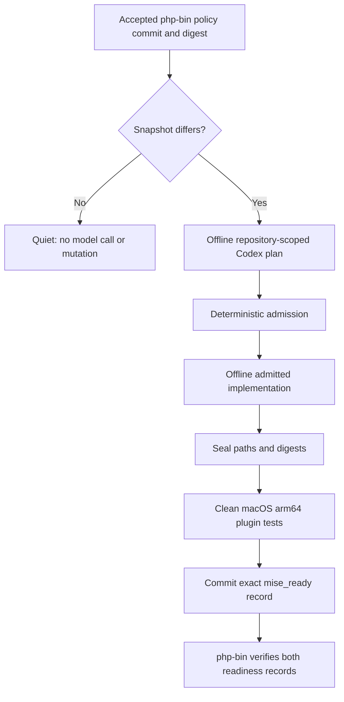
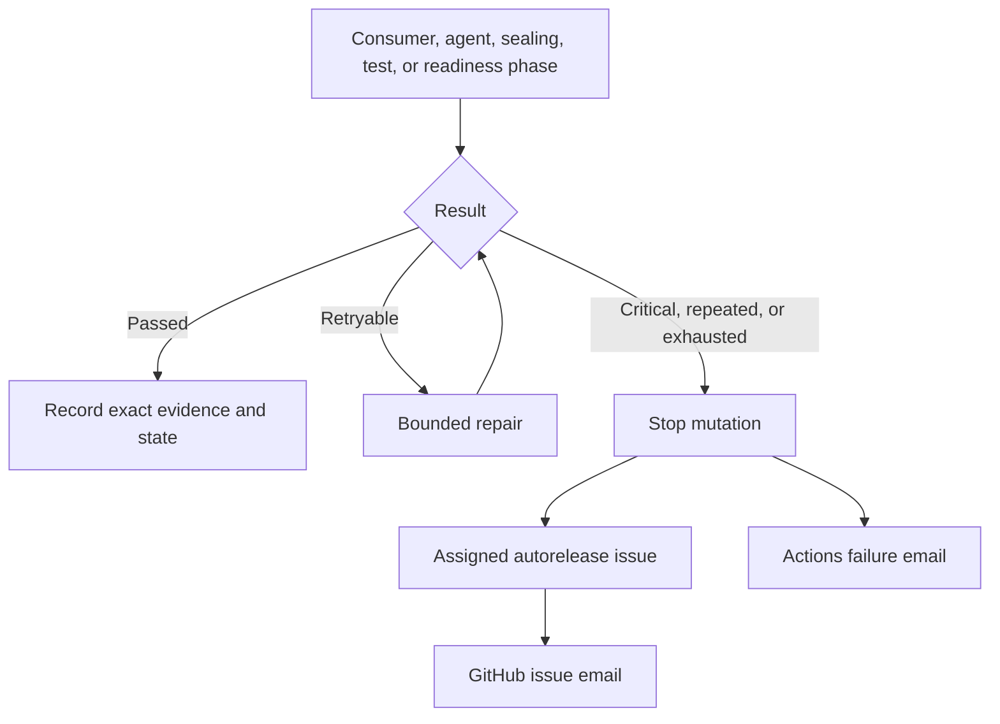

# Autorelease

How this repository consumes the accepted `php-bin` support policy,
prepares bounded repository work, and records the exact-commit readiness
that `php-bin` requires before it may publish a new branch.

The scheduled `php-bin policy consumer` captures the accepted public
`support-policy.json` and compares it with `support-snapshot.json`: the policy
digest, the invariants digest, the php-bin policy commit, the maintained
branches, and any locally incomplete event. It does not fetch or classify
upstream PHP lifecycle data. The run stops before that capture unless every
path in `autorelease/shared-files.json` is byte-identical with `php-bin` at the
exact commit the operator control was read from. When the exact policy
changes, the repository-scoped pinned Codex Action produces an evidence-bound
plan. Any implementation runs offline, without a GitHub write credential, and
only against admitted paths.

Which paths those are is the point. The *harness* is protected and never
model-editable: `scripts/test.sh`, `scripts/consume-php-policy`,
`scripts/generate-policy-lua`, `scripts/check-public-language.sh`, the sealing
and admission scripts, `test/`, `autorelease/`, `schemas/`, and
`.github/workflows/`. The *product* stays admissible: `hooks/*.lua`, `lib/`,
`metadata.lua`, and the generated `support-snapshot.json`. A model may change
what the plugin does, never what decides whether it still works, so the
protected plugin-contract tests are the standing control on every product
change. `autorelease-consumer.yml` runs `./scripts/test.sh` from the sealed
model commit for exactly that reason: the gates cannot have been part of the
patch, because admission rejects a protected path before sealing.



Only maintained branches appear in `mise ls-remote` or resolve from a branch
shorthand. An exact historical stable version may still install when its
immutable `php-bin` release and checksum assets exist. New branch publication
waits for matching `php_bin_ready` and `mise_ready` records at exact commits.

Failures and lifecycle transitions use one deduplicated GitHub issue per action
key, assigned through `AUTORELEASE_OWNER`. Comments are added only for meaningful
changes, and GitHub Actions failure email remains an independent fallback.
That issue is raised and updated by `php-bin`, which owns
`scripts/notify-autorelease` and the jobs holding `issues: write`. This
repository has no notification script and requests no issue permission at all,
so a failure confined to the consumer workflow reaches the owner through the
GitHub Actions failure email alone, until `php-bin` records it against the
action key.



## Unattended lifecycle

Tracking a new PHP branch takes zero human input here. No matcher in this
plugin is anchored to a major or minor version, so `8.6`, `9.0`, and `10.0`
need no code change. When the accepted `php-bin` policy adds a branch, the
admitted patch regenerates `support-snapshot.json` and `lib/policy.lua` from
it, the plugin contract tests run against the sealed commit, and the exact
`mise_ready` record commits under `readiness/`. That record merges without a
reviewer because `readiness/` and `autorelease-events/` sit outside CODEOWNERS
by design, while every protected control still cannot merge that way.
`php-bin` publishes the new branch only once its own `php_bin_ready` and this
`mise_ready` record agree at exact commits.

End of life is the same path in reverse and equally unattended. The branch
leaves the maintained set, so it stops appearing in `mise ls-remote` and stops
resolving from a shorthand such as `php@8.2`. Nothing is removed: an exact
published version such as `8.2.32` still installs, because its `php-bin`
release and checksum assets are immutable.

Pause unattended mutation in the reviewed
`php-bin/.github/autorelease-operator.json` control. Read-only capture and
investigation remain available while paused. Resume through a reviewed change;
partial events continue only through the deterministic next transition.

From a checkout containing both repositories:

```bash
(cd php-bin && ./scripts/test.sh)
(cd mise-php && ./scripts/test.sh)

./php-bin/scripts/verify-autorelease-system \
  --mise-repo ./mise-php \
  --php-bin-sha <exact-php-bin-sha> \
  --mise-php-sha <exact-mise-php-sha> \
  --output ./verification-results
```

Each repository's `scripts/test.sh` also validates every pinned Codex Action
invocation, exact CLI version, and canonical `config.toml` loading against the
reviewed offline contract in `.github/codex-action-contract.json` before
exercising autorelease behavior.

Inspect `support-snapshot.json`, `readiness/`, retained
workflow artifacts, and the event's GitHub issue. Recovery corrects the cause
and reruns the normal admitted path; it never disables checksum, policy,
sealing, exact-SHA, or publication gates.
