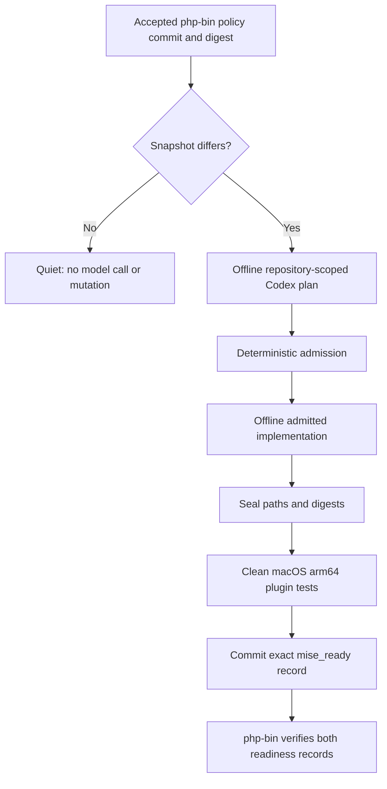
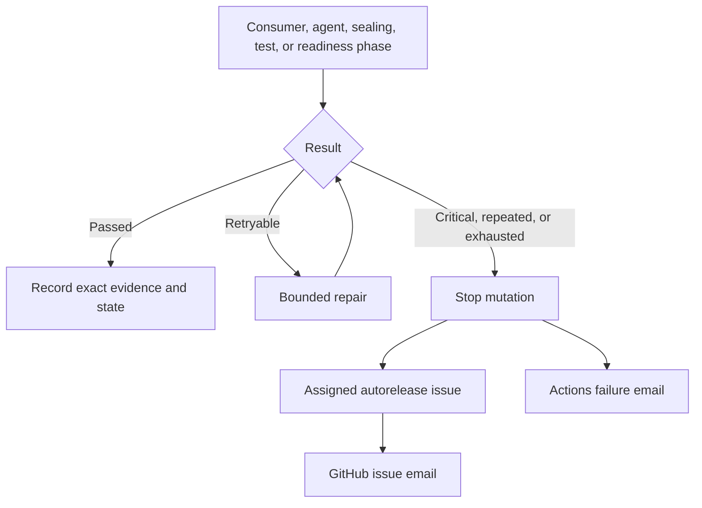

# Autorelease

How this repository consumes the accepted `php-bin` support policy,
prepares bounded repository work, and records the exact-commit readiness
that `php-bin` requires before it may publish a new branch.

The scheduled `php-bin policy consumer` captures the accepted public
`support-policy.json` and compares it with `support-snapshot.json`: the policy
digest, the invariants digest, the php-bin policy commit, the maintained
branches, and any locally incomplete event. It does not fetch or classify
upstream PHP lifecycle data. The run stops before that capture unless every
path in `autorelease/shared-files.json` is byte-identical with `php-bin` at the
exact commit the operator control was read from. When the exact policy
changes, the repository-scoped pinned Codex Action produces an evidence-bound
plan. Any implementation runs offline, without a GitHub write credential, and
only against admitted paths.



Only maintained branches appear in `mise ls-remote` or resolve from a branch
shorthand. An exact historical stable version may still install when its
immutable `php-bin` release and checksum assets exist. New branch publication
waits for matching `php_bin_ready` and `mise_ready` records at exact commits.

Failures and lifecycle transitions use one deduplicated GitHub issue per action
key, assigned through `AUTORELEASE_OWNER`. Comments are added only for meaningful
changes, and GitHub Actions failure email remains an independent fallback.



Pause unattended mutation in the reviewed
`php-bin/.github/autorelease-operator.json` control. Read-only capture and
investigation remain available while paused. Resume through a reviewed change;
partial events continue only through the deterministic next transition.

From a checkout containing both repositories:

```bash
(cd php-bin && ./scripts/test.sh)
(cd mise-php && ./scripts/test.sh)

./php-bin/scripts/verify-autorelease-system \
  --mise-repo ./mise-php \
  --php-bin-sha <exact-php-bin-sha> \
  --mise-php-sha <exact-mise-php-sha> \
  --output ./verification-results
```

Each repository's `scripts/test.sh` also validates every pinned Codex Action
invocation, exact CLI version, and canonical `config.toml` loading against the
reviewed offline contract in `.github/codex-action-contract.json` before
exercising autorelease behavior.

Inspect `support-snapshot.json`, `autorelease-events/`, `readiness/`, retained
workflow artifacts, and the event's GitHub issue. Recovery corrects the cause
and reruns the normal admitted path; it never disables checksum, policy,
sealing, exact-SHA, or publication gates.
