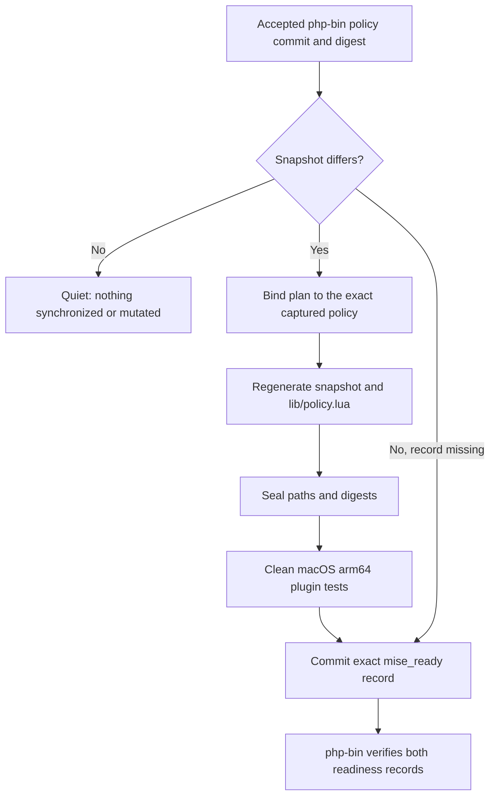
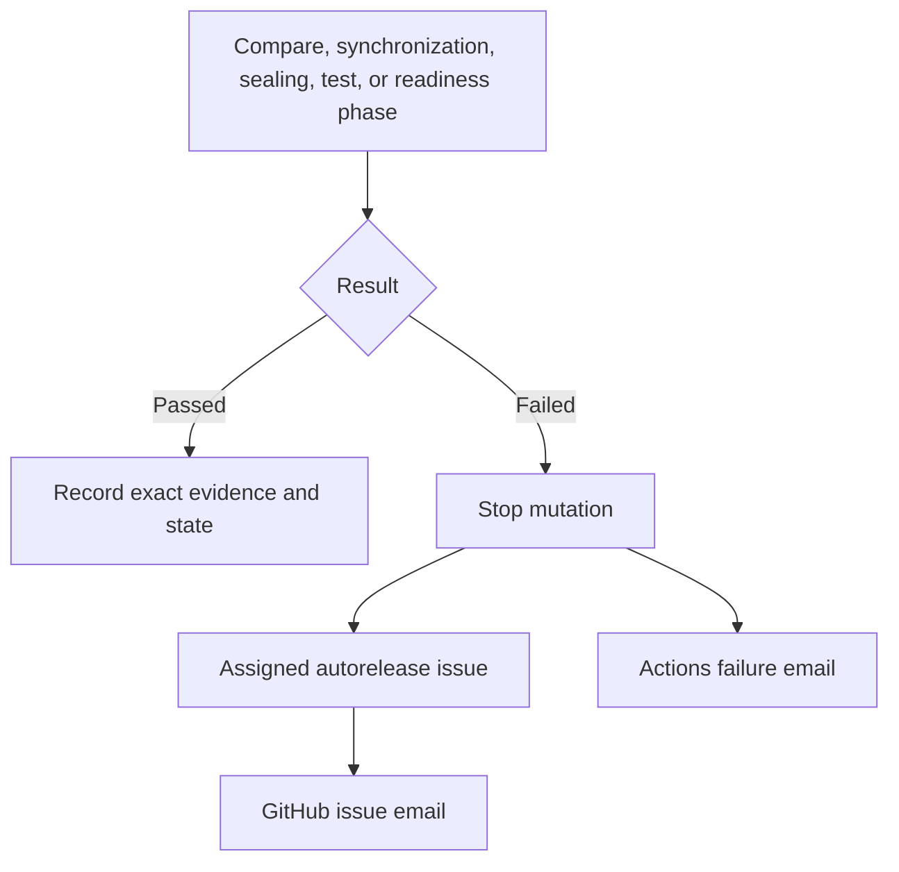

# Autorelease

How this repository consumes the accepted `php-bin` support policy,
regenerates its support snapshot from it, and records the exact-commit
readiness that `php-bin` requires before it may publish a new branch. No model
takes part in any step.

The scheduled `php-bin policy consumer` captures the accepted public
`support-policy.json` and compares it with `support-snapshot.json`: the policy
digest, the invariants digest, the php-bin policy commit, and the maintained
branches. It does not fetch or classify
upstream PHP lifecycle data. The run stops before that capture unless every
path in `autorelease/shared-files.json` is byte-identical with `php-bin` at the
exact commit the operator control was read from. When the exact policy
changes, `scripts/consume-php-policy plan` binds one synchronization to the
captured policy: its action key is the policy's own lifecycle key
(`new_branch:<branch>` or `branch_eol:<branch>:<date>`), its preconditions are
the exact mise-php base, php-bin policy commit, policy and invariants digests,
and php-bin operator state, and it admits exactly two paths.
`scripts/consume-php-policy synchronize` then regenerates
`support-snapshot.json` from the captured policy and `scripts/generate-policy-lua`
regenerates `lib/policy.lua` from the snapshot. A policy change without a
lifecycle key (a hand-edited `bootstrap` policy), or a capture whose bytes or
commits disagree, fails the run. A paused operator leaves the run read-only:
it captures and compares, then synchronizes nothing.

Which paths change is the point. The *harness* is protected: `scripts/test.sh`,
`scripts/consume-php-policy`, `scripts/generate-policy-lua`,
`scripts/check-public-language.sh`, the sealing and merge scripts, `test/`,
`autorelease/`, and `.github/workflows/`. The *product* is `hooks/*.lua`,
`lib/`, `metadata.lua`, and the generated `support-snapshot.json`; automation
writes only the snapshot and `lib/policy.lua`, and every other product change
arrives by reviewed pull request. `autorelease-consumer.yml` runs
`./scripts/test.sh` from the sealed commit, which is safe because sealing
rejects any protected path, so the gates cannot have been part of the patch.


```mermaid
flowchart TD
  policy["Accepted php-bin policy commit and digest"] --> compare{"Snapshot differs?"}
  compare -- "No" --> quiet["Quiet: nothing synchronized or mutated"]
  compare -- "Yes" --> plan["Bind plan to the exact captured policy"]
  plan --> patch["Regenerate snapshot and lib/policy.lua"]
  patch --> seal["Seal paths and digests"]
  seal --> test["Clean macOS arm64 plugin tests"]
  test --> ready["Commit exact mise_ready record"]
  ready --> release["php-bin verifies both readiness records"]
  compare -- "No, record missing" --> ready
```

Only maintained branches appear in `mise ls-remote` or resolve from a branch
shorthand. An exact historical stable version may still install when its
immutable `php-bin` release and checksum assets exist. New branch publication
waits for matching `php_bin_ready` and `mise_ready` records at exact commits.

Failures and lifecycle transitions use one deduplicated GitHub issue per action
key, assigned through `AUTORELEASE_OWNER`. Comments are added only for meaningful
changes, and GitHub Actions failure email remains an independent fallback.
That issue is raised and updated by `php-bin`, which owns
`scripts/notify-autorelease` and the jobs holding `issues: write`. This
repository has no notification script and requests no issue permission at all,
so a failure confined to the consumer workflow reaches the owner through the
GitHub Actions failure email alone, until `php-bin` records it against the
action key.

There is no repair phase: a failed step stops the run and retains its log, and
the next scheduled run captures the current policy and operator state again.

A synchronization merges in two pull requests, the snapshot first and its
readiness record second. A run that stops between them leaves the snapshot
current and no record, and `php-bin` waits for that record. The next run's
comparison notices: when the snapshot matches the policy, the policy carries a
lifecycle action key, and `readiness/` holds no record for it, the trigger is
`readiness_pending`. That run records readiness at the current `main` commit,
which carries the synchronized snapshot, through the same `record-readiness`
job and plugin checks, and closes any readiness pull request an earlier run
left open, since only the run that opened one can merge it. A record that
exists but names a different policy commit or digest fails the comparison
instead. A paused operator leaves the record pending with a warning, and a
pause that begins while the readiness checks run stops the merge and fails the
run.

A synchronization pull request that never merged, because its checks failed or
its run stopped, leaves the snapshot out of date, so the next run synchronizes
again. Each run pushes its synchronization to a branch of its own,
`autorelease/<action>-<run id>`, and never rewrites an existing branch. It then
closes the synchronization pull requests for the same action that earlier runs
left open, and deletes their branches.


```mermaid
flowchart TD
  phase["Compare, synchronization, sealing, test, or readiness phase"] --> result{"Result"}
  result -- "Passed" --> state["Record exact evidence and state"]
  result -- "Failed" --> stop["Stop mutation"]
  stop --> issue["Assigned autorelease issue"]
  issue --> email["GitHub issue email"]
  stop --> actions["Actions failure email"]
```

## Unattended lifecycle

Tracking a new PHP branch takes zero human input here. No matcher in this
plugin is anchored to a major or minor version, so `8.6`, `9.0`, and `10.0`
need no code change. When the accepted `php-bin` policy adds a branch, the
synchronization regenerates `support-snapshot.json` and `lib/policy.lua` from
it, the plugin contract tests run against the sealed commit, and the exact
`mise_ready` record commits under `readiness/`. That record merges without a
reviewer because `readiness/` and `autorelease-events/` sit outside CODEOWNERS
by design, while every protected control still cannot merge that way.
`php-bin` publishes the new branch only once its own `php_bin_ready` and this
`mise_ready` record agree at exact commits.

End of life is the same path in reverse and equally unattended. The branch
leaves the maintained set, so it stops appearing in `mise ls-remote` and stops
resolving from a shorthand such as `php@8.2`. Nothing is removed: an exact
published version such as `8.2.32` still installs, because its `php-bin`
release and checksum assets are immutable.

Pause unattended mutation in the reviewed
`php-bin/.github/autorelease-operator.json` control. Read-only capture and
comparison remain available while paused. Resume through a reviewed change;
partial events continue only through the deterministic next transition.

From a checkout containing both repositories:

```bash
(cd php-bin && ./scripts/test.sh)
(cd mise-php && ./scripts/test.sh)

./php-bin/scripts/verify-autorelease-system \
  --mise-repo ./mise-php \
  --php-bin-sha <exact-php-bin-sha> \
  --mise-php-sha <exact-mise-php-sha> \
  --output ./verification-results
```

Inspect `support-snapshot.json`, `readiness/`, retained
workflow artifacts, and the event's GitHub issue. Recovery corrects the cause
and reruns the normal path; it never disables checksum, policy,
sealing, exact-SHA, or publication gates.
