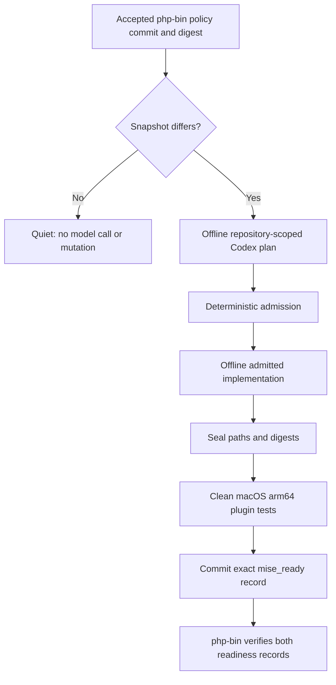
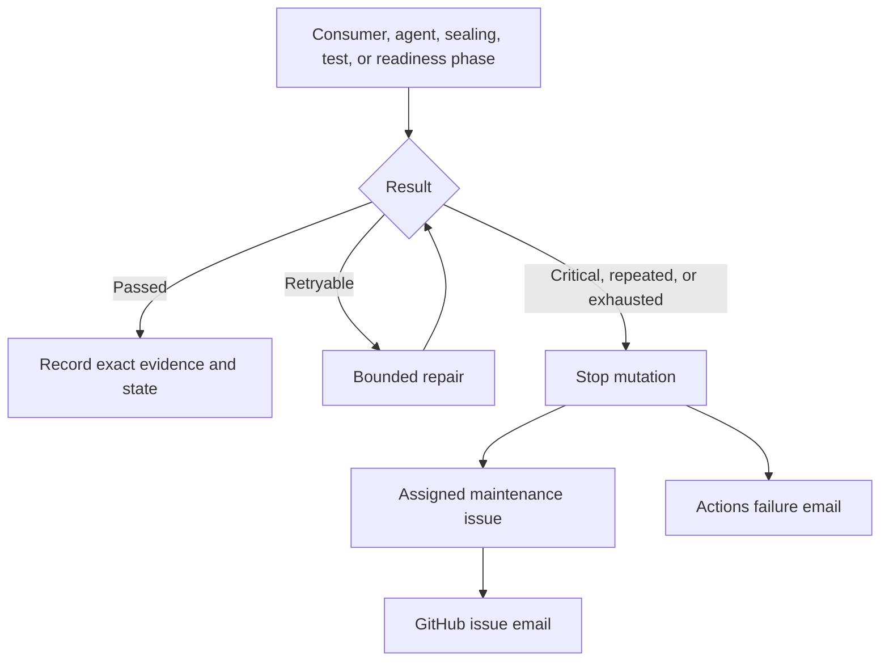

# mise-php

A mise tool plugin for prebuilt, fat static PHP on Apple Silicon Macs.

The plugin lists releases from
[`bigpixelrocket/php-bin`](https://github.com/bigpixelrocket/php-bin), downloads
the matching CLI archive, verifies its SHA-256 checksum, and exposes `bin/php`.
It never compiles PHP locally.

## Status

The plugin contract, offline end-to-end tests, and installation from published
`php-bin` releases are verified on macOS 26 arm64. Maintained PHP releases for
8.2 through 8.5 are available now.

## Requirements

- macOS 26 (Tahoe) or newer on arm64 / aarch64
- a current mise release with vfox tool-plugin support

The plugin supports the maintained PHP branches 8.2 through 8.5. PHP branches
that have reached end of life are intentionally not listed or installable.

Other operating systems and Intel Macs receive an explicit unsupported-target
error. Older macOS releases cannot load the published binaries.

## Guarded automatic maintenance

The scheduled `php-bin policy consumer` captures the accepted public
`support-policy.json` and compares only its digest and incomplete-event state
with `support-snapshot.json`. It does not fetch or classify upstream PHP
lifecycle data. When the exact policy changes, the repository-scoped pinned
Codex Action produces an evidence-bound plan. Any implementation runs offline,
without a GitHub write credential, and only against admitted paths.



Only maintained branches appear in `mise ls-remote` or resolve from a branch
shorthand. An exact historical stable version may still install when its
immutable `php-bin` release and checksum assets exist. New branch publication
waits for matching `php_bin_ready` and `mise_ready` records at exact commits.

Failures and lifecycle transitions use one deduplicated GitHub issue per action
key, assigned through `MAINTENANCE_OWNER`. Comments are added only for meaningful
changes, and GitHub Actions failure email remains an independent fallback.



Pause unattended mutation in the reviewed
`php-bin/.github/maintenance-operator.json` control. Read-only capture and
investigation remain available while paused. Resume through a reviewed change;
partial events continue only through the deterministic next transition.

From a checkout containing both repositories:

```bash
(cd php-bin && ./scripts/test.sh)
(cd mise-php && ./scripts/test.sh)

./php-bin/scripts/verify-maintenance-system \
  --mise-repo ./mise-php \
  --php-bin-sha <exact-php-bin-sha> \
  --mise-php-sha <exact-mise-php-sha> \
  --output ./verification-results
```

Each repository's `scripts/test.sh` also validates every pinned Codex Action
invocation, exact CLI version, and canonical `config.toml` loading against the
reviewed offline contract in `.github/codex-action-contract.json` before
exercising maintenance behavior.

Inspect `support-snapshot.json`, `maintenance-events/`, `readiness/`, retained
workflow artifacts, and the event's GitHub issue. Recovery corrects the cause
and reruns the normal admitted path; it never disables checksum, policy,
sealing, exact-SHA, or publication gates.

## Install

If another plugin is already installed under the `php` name, inspect it and
remove it before installing `mise-php`:

```bash
mise plugins ls --urls
mise plugins uninstall --purge php
```

Only run the uninstall command after confirming that `php` is the plugin you
want to replace. The `--purge` option also removes PHP versions, downloads, and
cache managed by that plugin.

```bash
mise plugin install php https://github.com/bigpixelrocket/mise-php
mise ls-remote php
mise use -g php@8.4
php -v
php -m
```

Pin a full patch or rebuild revision when repeatability matters:

```toml
[tools]
php = "8.4.5"
```

Mise also reads the plugin from a repository declaration:

```toml
[plugins]
php = "https://github.com/bigpixelrocket/mise-php"

[tools]
php = "8.4"
```

## Artifact verification

For a version such as `8.4.5`, the plugin requires both assets on the matching
`php-bin` GitHub Release:

```text
php-8.4.5-cli-macos-aarch64.tar.gz
SHA256SUMS
```

Installation fails if the release, archive, checksum file, or exact checksum
entry is missing. Mise performs the SHA-256 verification before activation.

## Runtime dependencies

Some compiled modules require an operating-system driver or external service
to perform useful work. In particular, SQL Server connections require a
compatible ODBC driver. See the
[`php-bin` runtime dependency guide](https://github.com/bigpixelrocket/php-bin/blob/main/docs/runtime-deps.md).

## Local development

```bash
mise plugin link php "$PWD"
mise ls-remote php
scripts/test.sh
```

The test suite serves a local fixture release and verifies version listing,
checksum-backed installation, and `PATH` activation through mise.

## Contributing and security

See [`CONTRIBUTING.md`](CONTRIBUTING.md). Report security issues using
[`SECURITY.md`](SECURITY.md), not a public issue.

## License

MIT. Downloaded PHP archives carry their own notices and licenses.
